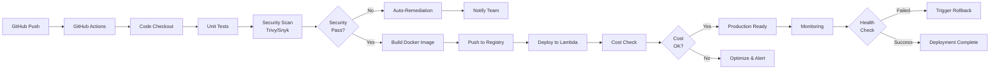

# serverless-cicd-pipeline

## Project Description
End-to-End Serverless CI/CD Pipeline with AWS Lambda, Step Functions, and CodePipeline integration. This project demonstrates a production-ready, cloud-native CI/CD implementation with DevSecOps scanning, automated remediation, cost optimization, and event-driven rollback capabilities.

### Key Features
- **Serverless Architecture**: AWS Lambda, Step Functions, EventBridge
- **CI/CD Pipeline**: GitHub Actions-based continuous integration and deployment
- **DevSecOps Integration**: Automated security scanning (Trivy, Snyk simulation)
- **Cost Optimization**: Real-time cost alarms and optimization monitoring
- **Auto-Remediation**: Event-driven automatic issue resolution
- **Rollback Mechanism**: Automated deployment rollback on failure
- **Fully Runnable Locally**: No AWS credentials required for testing

## Table of Contents
1. [Architecture Diagram](#architecture-diagram)
2. [Prerequisites](#prerequisites)
3. [Getting Started](#getting-started)
4. [Project Structure](#project-structure)
5. [CI/CD Workflow](#cicd-workflow)
6. [Step-by-Step Process](#step-by-step-process)
7. [Commands](#commands)
8. [Troubleshooting](#troubleshooting)

## Architecture Diagram



## Prerequisites
- Docker & Docker Compose
- Python 3.9+
- Git
- GitHub account with Actions enabled
- Make/Bash (for running scripts)
- YAML editor or IDE

## Getting Started

### 1. Clone the Repository
```bash
git clone https://github.com/DarshanCD123/serverless-cicd-pipeline.git
cd serverless-cicd-pipeline
```

### 2. Setup Local Environment
```bash
# Create Python virtual environment
python3 -m venv venv
source venv/bin/activate  # On Windows: venv\Scripts\activate

# Install dependencies
pip install -r requirements.txt
```

### 3. Run Local Tests
```bash
bash scripts/run-tests.sh
```

### 4. Build Docker Image Locally
```bash
bash scripts/build-docker.sh
```

## Project Structure

```
serverless-cicd-pipeline/
├── .github/
│  ├── workflows/
│  │  ├── ci-pipeline.yml
│  │  ├── security-scan.yml
│  │  ├── deploy.yml
│  │  └── rollback.yml
├── src/
│  ├── lambda/
│  │  ├── handler.py
│  │  ├── requirements.txt
│  │  └── __init__.py
│  ├── utils/
│  │  ├── logger.py
│  │  ├── config.py
│  │  └── __init__.py
├── terraform/
│  ├── main.tf
│  ├── variables.tf
│  ├── outputs.tf
│  └── lambda.tf
├── scripts/
│  ├── run-tests.sh
│  ├── build-docker.sh
│  ├── security-scan.sh
│  ├─┠ deploy.sh
│  └── rollback.sh
├── tests/
│  ├── test_handler.py
│  ├── test_lambda.py
│  └── __init__.py
├── Dockerfile
├── docker-compose.yml
├── requirements.txt
├── Makefile
├── .gitignore
├── README.md
└── DEPLOYMENT.md
```

## CI/CD Workflow

The GitHub Actions workflow executes the following stages:

### Stage 1: Trigger & Checkout
- Event: `push` to main branch
- Action: Checkout code

### Stage 2: Build & Test
- Install dependencies
- Run unit tests
- Generate test reports

### Stage 3: Security Scanning
- Trivy container image scan
- Dependency vulnerability check
- SAST analysis simulation

### Stage 4: Build & Push
- Build Docker image
- Tag with version
- Push to registry (simulation)

### Stage 5: Deploy
- Deploy to Lambda function
- Update environment variables
- Run smoke tests

### Stage 6: Post-Deployment
- Monitor CloudWatch logs
- Run health checks
- Trigger rollback if needed

## Step-by-Step Process

### Developer Workflow
1. **Local Development**
   - Clone repository
   - Create feature branch
   - Write code and tests

2. **Local Testing**
   ```bash
   make test
   make lint
   make security-scan-local
   ```

3. **Push to GitHub**
   ```bash
   git add .
   git commit -m "feature: add new functionality"
   git push origin feature-branch
   ```

4. **GitHub Actions Trigger**
   - CI pipeline starts automatically
   - Runs tests and security scans
   - Builds Docker image

5. **Automated Security Checks**
   - Container image scanning
   - Dependency scanning
   - Auto-remediation if vulnerabilities found

6. **Deployment Phase**
   - Lambda function update
   - Environment configuration
   - Health checks

7. **Monitoring & Rollback**
   - CloudWatch metrics monitoring
   - Error rate detection
   - Automatic rollback trigger

## Commands

### Development Commands
```bash
# Setup
make setup              # Install dependencies and setup environment
make venv              # Create Python virtual environment

# Testing
make test              # Run all tests
make test-unit         # Run unit tests only
make test-coverage     # Generate coverage report

# Code Quality
make lint              # Run linting
make format            # Format code
make type-check        # Run type checking

# Security
make security-scan-local   # Run local security scan
make check-deps            # Check for vulnerable dependencies

# Docker
make build-docker      # Build Docker image
make run-docker        # Run Docker container locally
make stop-docker       # Stop Docker container

# Deployment
make deploy            # Deploy to Lambda
make rollback          # Rollback last deployment

# Infrastructure
make terraform-init    # Initialize Terraform
make terraform-plan    # Plan infrastructure changes
make terraform-apply   # Apply infrastructure changes

# Cleanup
make clean             # Clean build artifacts
make clean-docker      # Remove Docker images
```

### Git Commands
```bash
# Feature Development
git checkout -b feature/your-feature
git add .
git commit -m "feature: description"
git push origin feature/your-feature

# Create Pull Request
# (Use GitHub UI)

# Merge to Main
git checkout main
git pull origin main
git merge feature/your-feature
git push origin main
```

### AWS Simulation Commands (Local)
```bash
# Simulate Lambda execution
bash scripts/simulate-lambda.sh

# Simulate Step Functions workflow
bash scripts/simulate-step-functions.sh

# Simulate CodePipeline execution
bash scripts/simulate-codepipeline.sh
```

## Troubleshooting

### Common Issues

**Issue: Tests failing locally**
```bash
# Solution:
rm -rf venv
python3 -m venv venv
source venv/bin/activate
pip install -r requirements.txt
make test
```

**Issue: Docker build failing**
```bash
# Solution:
make clean-docker
make build-docker
```

**Issue: GitHub Actions failing**
- Check workflow logs in GitHub UI
- Verify secrets are set correctly
- Ensure branch protections are not blocking

## Technologies Used
- Python 3.9
- Docker & Docker Compose
- Terraform (IaC)
- GitHub Actions (CI/CD)
- AWS Lambda, Step Functions, CodePipeline
- Trivy (Security Scanning)
- pytest (Testing)

## Author
Darshan C D - DevOps Engineer | Cloud Architect

## License
MIT
